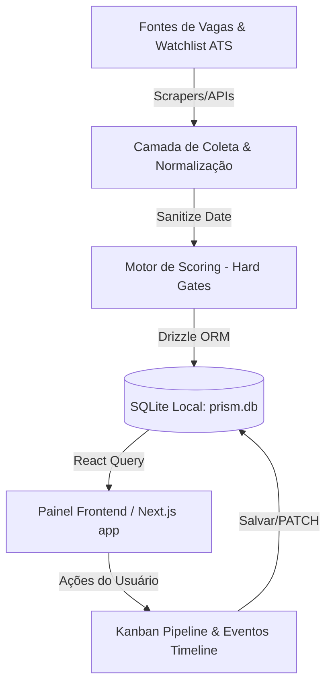

# Prism 

> **Tagline:** A local-first job search intelligence system for turning noisy job markets into clear decisions.  
> **Narrativa Profissional:** *Built around the thesis: "Dados imperfeitos, decisões claras."*

O **Prism** é um sistema web pessoal, local-first, single-user e sem autenticação externa, desenvolvido para centralizar, monitorar, classificar e organizar a busca por vagas de emprego e projetos freelance de Felipe Alirio Baruja.

---

## 1. O Problema
A busca por emprego hoje é barulhenta, fragmentada e ineficiente:
- **Ruído:** Agregadores enviam centenas de vagas com títulos genéricos e sem fit técnico.
- **Inconsistência:** Parsing de datas corrompe a ordenação temporal das vagas (anos errados, dados inválidos).
- **Falta de Rastreabilidade:** Candidaturas feitas em portais diferentes (LinkedIn, Gupy, sites de carreiras) ficam perdidas em abas soltas.
- **Desperdício de Foco:** Misturar vagas excelentes com oportunidades suprimidas (domínios e senioridades incompatíveis) reduz a agilidade de decisão.

---

## 2. A Solução
O Prism centraliza a descoberta de vagas e automatiza o processo de triagem baseando-se em precisão:
- **Centralização:** Conectores buscam vagas e projetos de dezenas de portais em tempo real.
- **Curadoria e Scoring Relevante:** Um motor de classificação por domínios e regras de *Hard Gates* bloqueia ruído.
- **CRM e Pipeline de Candidaturas:** Acompanhamento do funil de candidaturas com registro automático de eventos e timeline.
- **Analytics Acionável:** Indicadores de taxa de conversão por canais/fontes de vagas para focar no que dá resultado.

---

## 3. Principais Funcionalidades

- **Radar (Homepage):** Exibe as vagas novas divididas por faixas de fit: *Excelente Fit (&ge;85%)*, *Fit Bom/Moderado (70-84%)* e *Últimas vagas*. Oculta automaticamente vagas suprimidas ou fora de foco.
- **Explorar:** Busca avançada com filtros dinâmicos de Domínio de Vaga (Dados, Analytics, Engenharia de Dados, Backend/Fullstack, etc.), Senioridade, Modalidade, Contrato, Stack, Fontes de Vaga, Alertas/Warnings de Score, e status no pipeline. Permite opcionalmente visualizar vagas suprimidas em layout demarcado.
- **Pipeline (CRM):** Quadro Kanban interativo com estágios de candidatura (*Salvas*, *Prioritárias*, *Preparando*, *Aplicadas*, *Em análise*, *Entrevista*, *Oferta*, *Recusadas*, *Arquivadas*) com atalhos de transição rápida e timeline detalhada de ações.
- **Analytics:** Painel de métricas práticas:
  - Funil de candidaturas (Coletas &rarr; Pipeline &rarr; Aplicada &rarr; Entrevista &rarr; Oferta).
  - Taxas de conversão acionáveis de canais de aquisição.
  - Tabela comparativa de aproveitamento por fonte/canal.
  - Alerta central de conexões/sincronizações com falha de conexão.
  - Histórico de volume de coletas diárias dos últimos 30 dias.
- **Fontes & Empresas Monitoradas (Watchlist - Cobertura Brasil):**
  - Monitoramento da saúde de sincronização de cada conector de vagas.
  - **Brazilian Company Watchlist:** Rastreia e prioriza portais de carreira de mais de 550 empresas brasileiras (fintechs, e-commerce, scale-ups, startups, etc.) já classificadas por setor e prioridade.
  - **Detecção Inteligente de ATS:** Detecta e valida endpoints de portais de carreiras baseados em **Greenhouse**, **Lever**, **Ashby**, e **Gupy**.
  - **Sync por Prioridade (P0/P1/P2):** Permite rodar varreduras por prioridade via comandos como `npm run companies:sync:p0`.
- **Freelas:** Projetos freelance analisados por motor próprio de pontuação para o perfil técnico de Felipe (Foco em dados/web-scraping/automação).

---

## 4. Arquitetura e Tecnologia Stack

O Prism é construído com foco em desempenho, integridade e local-first:
- **Framework Frontend:** [Next.js](https://nextjs.org/) (App Router, Tailwind CSS, Lucide Icons).
- **Gerenciamento de Estado/Queries:** React Query (TanStack Query) para caching offline.
- **Banco de Dados Local:** [SQLite](https://www.sqlite.org/) local (`prism.db`), garantindo controle absoluto dos dados e privacidade.
- **ORM:** [Drizzle ORM](https://orm.drizzle.team/) para definições tipadas, migrações e consultas robustas.
- **Visualização de Dados:** Recharts para gráficos de funil, linhas e barras horizontais.



---

## 5. Como o Scoring Funciona

O motor de pontuação prioriza **precisão sobre recall**. Ele funciona através de um filtro de barreiras sequenciais (*Hard Gates*):

1. **Classificação de Domínio:** O título da vaga é classificado em categorias (*data, data_engineering, analytics, ai_llm, fullstack_backend, software_engineering*, etc.).
2. **Hard Gates (Travas de Segurança):**
   - **Domínio Incompatível** (*design, legal, sales, finance_ops, admin_support*): Score máximo travado em **30%** (Fit: *Fora do Foco / Suprimida*).
   - **Desconhecido Sem Termo Técnico:** Domínios desconhecidos sem skills chave no título são limitados a **55%** (*Revisar*).
   - **Mapeamento de Senioridade:** Vagas de liderança/sênior para perfil de entrada são limitadas a **55%**.
   - **Barreira de Localização:** Vagas presenciais fora de São Carlos/SP são limitadas a **60%**.
   - **Palavras Negativas:** Tecnologias fora de interesse (SAP, Cobol, Delphi, VBA, Mainframe) travam o score em **35%**.
3. **Subscores de Aderência:** Somente após passar pelos gates o score calcula pesos para hard skills de interesse (Python, SQL, TypeScript, FastAPI, Supabase, Next.js, etc.), modalidade, salário e recência.
4. **Resolução de Fit:** As vagas são classificadas entre *Excelente fit (&ge;85%)*, *Bom fit (70-84%)*, *Revisar (50-69%)*, *Baixo fit (<50%)* e *Fora do foco* (suprimidas).

---

## 6. Como Executar Localmente

### Requisitos
- Node.js (v18+)
- SQLite3 instalado localmente no Windows.

### Configuração do Projeto
1. Clone o repositório no caminho padrão:
   ```bash
   git clone https://github.com/BarujaFe1/Prism.git C:\dev\Prism
   ```
2. Instale as dependências:
   ```bash
   npm install
   ```
3. Configure as variáveis de ambiente (.env):
   ```env
   DATABASE_URL="file:./prism.db"
   ```
4. Execute as migrações e rode o banco local:
   ```bash
   npx drizzle-kit push
   ```
5. Inicie o servidor de desenvolvimento:
   ```bash
   npm run dev
   ```
   Acesse em: [http://localhost:3000](http://localhost:3000).

### Scripts de Coleta e Recalcular Scores
- **Recalcular Scores de Vagas:**
  ```bash
  npx tsx src/db/compute-scores.ts
  ```
- **Recalcular Scores de Freelancers:**
  ```bash
  npx tsx scripts/compute-freelance-scores.ts
  ```

---

## 7. Segurança, Dados e Backups

Sendo um sistema **local-first**, todos os dados são salvos em `prism.db`.
- **Nenhum Dado Remoto:** O Prism não envia suas buscas ou perfil para servidores terceiros.
- **Backup Manual:** Recomenda-se realizar cópias frequentes de `prism.db`.
  O backup de pré-implementação fica salvo no diretório `/backups/`.

---

## 8. Autor e Links
- **Autor:** Felipe Alirio Baruja (Estudante de Estatística e Ciência de Dados na USP/ICMC).
- **GitHub:** [https://github.com/BarujaFe1](https://github.com/BarujaFe1)
- **LinkedIn:** [Felipe Alirio Baruja](https://www.linkedin.com/in/felipe-baruja/)
- **Portfólio:** [Felipe Alirio Baruja Portfólio](https://github.com/BarujaFe1)
