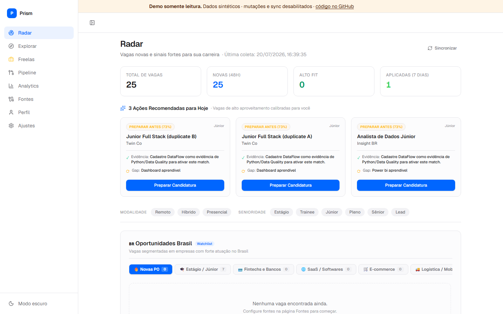

# Prism

**Local-first opportunity ranking for noisy job markets** — ingest sources, normalize + dedupe, score fit with explainable rules, and run Radar → Pipeline → Analytics.

> Portfolio role: personal MVP / lab for **full-stack + product + data** thinking. Not a multi-tenant SaaS. Not an “AI hiring platform”.

**EN summary:** Prism helps a single user (the builder) reduce the cognitive cost of finding, ranking, and tracking jobs/freelance leads using TypeScript, Next.js, SQLite/libSQL, and a deterministic scoring engine.



---

## Recruiter quick view (≈5 min)

| | |
|---|---|
| **What** | Personal job-search intelligence cockpit |
| **Stack** | Next.js 16 · React 19 · TypeScript · Drizzle · SQLite/libSQL · TanStack Query |
| **Proof** | CI workflow · unit tests · demo seed · demo read-only mode |
| **Author** | Felipe Alírio Baruja — Estatística e Ciência de Dados (USP) · seeking estágio / trainee / júnior |
| **Run** | `DATABASE_URL=file:demo.db npm run demo:seed` then `PRISM_DEMO_MODE=1 npm run dev` |
| **Public demo URL** | https://prism-ruddy-sigma.vercel.app (read-only) |

Positioning: *Desenvolvedor Full-Stack orientado a produto que constrói ferramentas de decisão com TypeScript, React/Next.js, Node, SQL, dados e automação.*

---

## Problem

Job search is fragmented: duplicates, missing salary, noisy titles, no ranking, candidacies spread across tabs.

## Solution

1. **Ingest** public APIs/RSS/connectors  
2. **Normalize** fields  
3. **Dedupe** near-duplicates  
4. **Score** with explainable weighted rules + hard gates + red flags  
5. **Act** via Radar, Kanban pipeline, analytics  


```mermaid
flowchart LR
  C[Connectors] --> E[Normalize / Dedupe / Score]
  E --> DB[(SQLite / libSQL)]
  DB --> API[Route Handlers]
  API --> UI[Radar / Pipeline / Analytics]
```

Scoring methodology: [`docs/SCORING.md`](docs/SCORING.md) — **rules engine**, not ML.

---

## Features (verified in repo)

- Radar, Explore filters, job detail with score breakdown
- Pipeline Kanban + events / follow-ups / tasks
- Analytics funnels and source views
- Brazilian company watchlist file (~**559** rows in `empresas/…csv`) + sync scripts by priority — **list size ≠ proven live sync for every company**
- Freelance module with separate scoring helpers
- `PRISM_DEMO_MODE` blocks mutations/sync/rescore on the server

---

## Stack & decisions

| Decision | Why |
|---|---|
| SQLite/libSQL | Local-first DX; Turso for hosted demo ([ADR](docs/adr/001-sqlite-libsql.md)) |
| Explainable score | Testable, offline, interview-defensible ([ADR demo](docs/adr/002-demo-read-only.md)) |
| No auth yet | Single-user; public demo must be read-only |
| No LLM ranking | Rules first; optional AI only after baseline evaluation |

---

## Quick start

**Node ≥ 22** (see `.nvmrc`).

```bash
git clone https://github.com/BarujaFe1/Prism.git
cd Prism
cp .env.example .env.local
npm ci

# Full local setup (legacy seed + scores)
npm run setup
npm run dev

# OR synthetic demo DB (recommended for demos)
DATABASE_URL=file:demo.db npm run db:push
DATABASE_URL=file:demo.db npm run demo:seed
PRISM_DEMO_MODE=1 DATABASE_URL=file:demo.db npm run dev
```

Open http://localhost:3000

---

## Quality gates

```bash
npm run lint
npm run typecheck
npm test
npm run build
npm run ci
```

CI: [`.github/workflows/ci.yml`](.github/workflows/ci.yml) (Node 22).

---

## Security

- No mass assignment on PATCH; allowlisted fields only
- Job list filters use Drizzle `inArray` (no string-built `IN` lists)
- Demo mode returns `403` / `DEMO_READ_ONLY` for mutations
- Never commit `.env`, tokens, or `*.db` — see [`SECURITY.md`](SECURITY.md)

---

## Deploy / demo

Strategy and checklist: [`docs/deployment.md`](docs/deployment.md) · [`docs/demo-mode.md`](docs/demo-mode.md)

Hosted read-only demo: [prism-ruddy-sigma.vercel.app](https://prism-ruddy-sigma.vercel.app) (`PRISM_DEMO_MODE=1`, bundled SQLite). Dataset is curated from the owner's personal radar (high/good fit jobs + profile); mutations stay blocked.

---

## Honest status

| Item | Status |
|---|---|
| Local demo + synthetic seed | Yes |
| Unit tests + CI workflow in this branch | Yes |
| Public auth | No |
| Live public demo URL | Yes — https://prism-ruddy-sigma.vercel.app (`PRISM_DEMO_MODE=1`) |
| Real PNG screenshots in repo | Yes — `docs/assets/` (captured from live demo) |
| “Real-time” multi-source streaming | No — sync/connectors are batch/on-demand |
| All 559 watchlist companies verified synced | No — file + tooling exist; coverage varies |

---

## Docs

- [`docs/case-study/prism-case-study-pt-BR.md`](docs/case-study/prism-case-study-pt-BR.md) · [EN](docs/case-study/prism-case-study-en.md)
- [`docs/career/`](docs/career/) — currículo, LinkedIn, guia de entrevista
- [`docs/deployment.md`](docs/deployment.md) · [`docs/demo-mode.md`](docs/demo-mode.md)
- [`docs/SCORING.md`](docs/SCORING.md) · [`docs/CONNECTORS.md`](docs/CONNECTORS.md)
- [`docs/execution/`](docs/execution/) — transformation progress for this portfolio pass
- [`CONTRIBUTING.md`](CONTRIBUTING.md) · [`CHANGELOG.md`](CHANGELOG.md)

---

## Why this project matters (for hiring)

Shows end-to-end product engineering: domain modeling, SQL/ORM, API hardening, deterministic ranking, UX for decisions, and honest documentation of limits — appropriate for **estágio / trainee / júnior** full-stack or product-oriented roles.

---

Built by **Felipe Alírio Baruja** · [github.com/BarujaFe1/Prism](https://github.com/BarujaFe1/Prism) · [LinkedIn](https://www.linkedin.com/in/felipe-baruja/)
