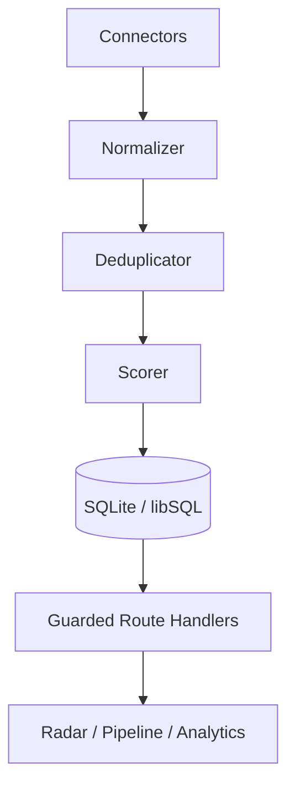

# Case Study — Prism (EN)

**Author:** Felipe Alírio Baruja  
**Documented period:** 2026 (`feat/employability-transformation`)  
**Type:** Personal local-first MVP — full-stack + product + data evidence  
**Not:** Multi-tenant SaaS, enterprise platform, or “AI hiring product”

---

## Context

I’m a Statistics & Data Science student at USP (Brazil) looking for internship / trainee / junior full-stack or product engineering roles. Prism exists because my own job search was fragmented and cognitively expensive.

## Problem

Opportunities are scattered across portals; duplicates and weak titles waste time; there is no ranking aligned to an entry-level TypeScript/React/data profile; applications lack a lightweight CRM.

## Audience

1. Primary user: the builder (personal cockpit)  
2. Portfolio audience: recruiters evaluating delivery judgment

## Insight

Thesis: **imperfect data, clear decisions**. Prefer an **explainable rules engine** over LLM ranking for cost, testability, and interview defensibility.

## Solution

`Connectors → normalize → dedupe → score (hard gates + weights) → SQLite → UI (Radar / Pipeline / Analytics)`

## Stack

Next.js 16 · React 19 · TypeScript · Tailwind 4 · Drizzle · SQLite/libSQL · TanStack Query · Zustand · Recharts · GitHub Actions

## Architecture

## Key decisions

| Choice | Trade-off |
|---|---|
| SQLite/libSQL | Great local DX; hosted demo needs Turso |
| Rules scoring | Less “AI hype”; more explanation + tests |
| No auth yet | Simple locally; public demo must be read-only |
| Skip Postgres for now | Avoid ceremony without multi-user needs |

## Security hardening (this branch)

Allowlisted PATCH fields, Drizzle `inArray` filters, server-enforced `PRISM_DEMO_MODE`, protected secrets/DB files.

## Reliability

Unit tests + CI (Node 22). Synthetic `demo:seed`. No production SLOs claimed.

## Limitations

No live public demo URL yet; watchlist file size ≠ verified sync coverage; connector failures are partial; PNG screenshots and axe E2E still pending.

## What I’d do differently

Ship read-only hosted demo earlier; add `scoreVersion` + golden-set metrics before more connectors; automate a11y checks sooner.

## Links

https://github.com/BarujaFe1/Prism · `docs/execution/` · `docs/demo-mode.md`
