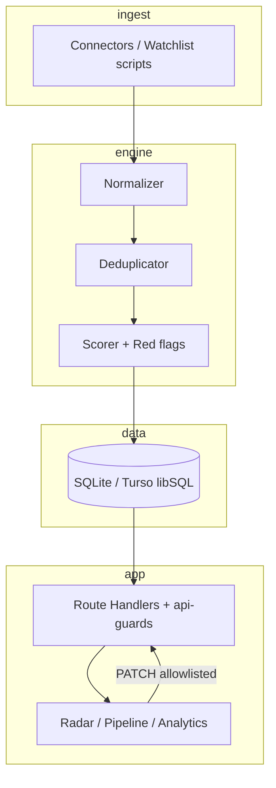

# Case Study — Prism (pt-BR)

**Autor:** Felipe Alírio Baruja  
**Período documentado:** 2026 (branch `feat/employability-transformation`)  
**Tipo:** MVP pessoal local-first / evidência de engenharia full-stack + produto + dados  
**Não é:** SaaS multi-tenant, plataforma enterprise, nem “produto de IA”

---

## Contexto

Sou estudante de Estatística e Ciência de Dados na USP e busco estágio, trainee ou vaga júnior em desenvolvimento full-stack / product engineering. Construí o Prism para resolver um problema real meu: a busca por oportunidades é fragmentada, barulhenta e difícil de priorizar.

## Problema

- Vagas espalhadas em LinkedIn, Gupy, Remote OK, portais ATS, etc.
- Duplicatas, títulos genéricos, salário ausente
- Sem ranking alinhado ao perfil (estágio/júnior + TypeScript/React/dados)
- Candidaturas sem CRM leve (status, follow-ups, timeline)

## Público

1. **Usuário primário:** eu (cockpit pessoal)  
2. **Audiência de portfólio:** recrutadores e hiring managers avaliando capacidade de entrega

## Descoberta

A hipótese de produto é: **dados imperfeitos, decisões claras**. Em vez de maximizar recall com LLM, priorizei **precisão com regras explicáveis** — mais barato, testável e defensável em entrevista.

## Solução

Pipeline:

`Conectores → normalização → deduplicação → scoring (hard gates + pesos) → SQLite → UI (Radar / Pipeline / Analytics)`

Fluxos principais:

1. Radar com faixas de fit  
2. Detalhe da vaga com breakdown de score  
3. Pipeline Kanban + eventos  
4. Analytics de funil/fontes  
5. Watchlist de empresas BR (arquivo + scripts de sync por prioridade)

## Stack

Next.js 16 · React 19 · TypeScript · Tailwind 4 · Drizzle · SQLite/libSQL · TanStack Query · Zustand · Recharts · GitHub Actions

## Arquitetura

## Modelo de dados (resumo)

- `jobs` — oportunidade + status + score + metadados de fonte  
- `job_events` / `job_followups` / `application_tasks` — CRM leve  
- `profile` / `settings` — preferências locais  
- `monitored_companies` — watchlist  
- Tabelas freelance paralelas para projetos/propostas  

Índices adicionados em status, score, posted_at, source, hash e unique `(source, source_id)`.

## Decisões e trade-offs

| Decisão | Trade-off |
|---|---|
| SQLite/libSQL | Excelente DX local; serverless precisa Turso |
| Score por regras | Menos “wow de IA”; mais explicabilidade e testes |
| Sem auth | Simples localmente; demo pública = somente leitura |
| Cron no processo web | Útil localmente; inadequado em serverless |
| Não migrar para Postgres agora | Evita overengineering sem multi-usuário |

## Segurança

Pass de hardenings nesta branch:

- Filtros de jobs com `inArray` (sem SQL montado por string de lista)  
- PATCH com allowlist (score/fitLabel **não** editáveis pelo cliente)  
- `PRISM_DEMO_MODE` bloqueia mutações/sync/rescore no servidor  
- `.gitignore` protege `*.db` e `.env`  

Detalhes: `SECURITY.md`, `docs/demo-mode.md`.

## Confiabilidade e testes

- `npm test` — guards de API, normalizer, scoring gates, red flags, dedupe (25 testes na última medição)  
- CI GitHub Actions: lint + typecheck + test + build (Node 22)  
- Dataset sintético: `npm run demo:seed`  

**Ainda não medido em produção:** precision@k com usuários reais, uptime, Lighthouse publicado.

## Performance

- Paginação/limites nas APIs de jobs (`limit` clamped)  
- Agregações pesadas ainda podem melhorar (trabalho futuro)  
- Relatório Lighthouse: pendente de captura versionada

## Acessibilidade

- Banner de demo com `role="status"`  
- Auditoria axe/E2E: **ainda não automatizada** nesta branch  

## Scoring

Motor determinístico com classificação de domínio, hard gates (ex.: sales/design, senioridade incompatível), pesos de skills/local/salário/recência e red flags heurísticas.

Versão das regras: código em `src/engine/scorer.ts` + `src/lib/scoring/scoring-rules.ts`. Versionamento explícito `scoreVersion` no schema: **pendente**.

## Limitações assumidas

- Sem URL pública de demo provisionada  
- Watchlist ~559 empresas no CSV ≠ sync validado para todas  
- Conectores podem falhar isoladamente (parcial)  
- Screenshots PNG reais ainda não versionados  
- Não há autenticação multi-usuário  

## Aprendizados

1. Segurança de API importa mesmo em app “pessoal” se for demo pública.  
2. Documentar o que **não** está pronto aumenta credibilidade.  
3. Regras de scoring bem testadas valem mais no currículo júnior do que um LLM sem avaliação.  

## Próximos passos

1. Demo read-only na Vercel + Turso  
2. Playwright + axe nas páginas principais  
3. Case metrics em golden set (precision@5 lab)  
4. Ativos de carreira alinhados a este repositório  

## Links

- Repo: https://github.com/BarujaFe1/Prism  
- Branch de trabalho: `feat/employability-transformation`  
- Execução: `docs/execution/`  
